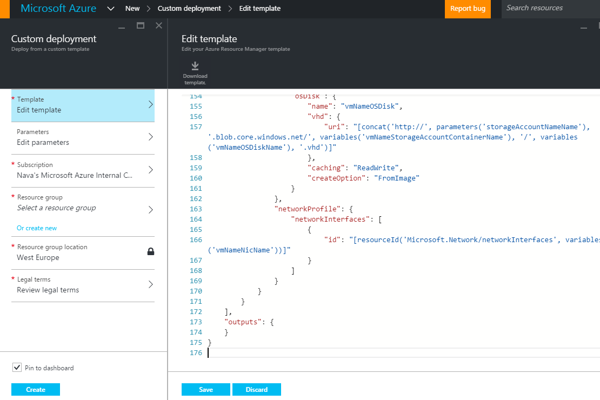

#  Deploying a Template
There are several ways to deploy a template, all described in details in the [Tools](../Tools/README.md) section of this document. You can also find examples in each programing language [SDK](../ARM/SDKs/README.md) section.
We will cover in high level some of the deployment methods, to get you started with deploying templates:

## Deployment Mode
Deployments can be either Incremental or Complete. In Incremental mode, resources are deployed without deleting existing resources that are not included in the template. In complete mode resources are deployed and existing resources in the resource group not included in the template are deleted. The default mode is Incremental. For more info, visit [Deploy an application with Azure Resource Manager template](https://azure.microsoft.com/en-gb/documentation/articles/resource-group-template-deploy/)

## Powershell
Azure PowerShell is currently available in two releases - 1.0 and 0.9.8. The examples in this section use the 1.0 version.
For information about the 1.0 release, including how to install and uninstall the release, see [Azure PowerShell 1.0 Preview](https://azure.microsoft.com/en-us/blog/azps-1-0-pre/). 

The following example will deploy a template file using a parameter file. In this example the template and parameters files are hosted localy:
```powershell
# login to azure account
Login-AzureRmAccount

# select your subscription
Select-AzureRmSubscription -SubscriptionID <YourSubscriptionId>

# create a new resource group, if one does not exist
New-AzureRmResourceGroup -Name ExampleResourceGroup -Location "West US"

# deploy the template using a parameter file
New-AzureRmResourceGroupDeployment -Name ExampleDeployment -ResourceGroupName ExampleResourceGroup -TemplateFile <PathOrLinkToTemplate> -TemplateParameterFile <PathOrLinkToParameterFile>
```

Deploy using inline parameters:
```powershell
New-AzureRmResourceGroupDeployment -Name ExampleDeployment -ResourceGroupName ExampleResourceGroup -TemplateFile <PathOrLinkToTemplate> -myParameterName "parameterValue"
```

Deploy using a parameters object:
```powershell
$parameters = @{"<ParameterName>"="<Parameter Value>"}
New-AzureRmResourceGroupDeployment -Name ExampleDeployment -ResourceGroupName ExampleResourceGroup -TemplateFile <PathOrLinkToTemplate> -TemplateParameterObject $parameters
```

Deploy with template and parameters file URIs:
```powershell
New-AzureRmResourceGroupDeployment -Name ExampleDeployment -ResourceGroupName ExampleResourceGroup -TemplateUri <template uri> -TemplateParameterUri <parameters file uri>
```
## Command Line Interface
I assume that you have some experiance with using the Azure CLI. if not, no harm - get started with [this](https://azure.microsoft.com/en-us/documentation/articles/xplat-cli-azure-resource-manager/) overview.
The follwoing deploys a local template file using inline parameters:
```bash
azure login
azure config mode arm

azure group create -n ExampleResourceGroup -l "West US"

azure group deployment create -f <PathToTemplate> -p "{\"ParameterName\":{\"value\":\"ParameterValue\"}}" -g ExampleResourceGroup -n ExampleDeployment
```
Deploy using a template URI:
```bash
azure group deployment create --template-uri <LinkToTemplate> -p "{\"ParameterName\":{\"value\":\"ParameterValue\"}}" -g ExampleResourceGroup -n ExampleDeployment
 ```
 
Deploying using a parameters file:
```bash
 azure group deployment create -f <PathToTemplate> -e <PathToParameterFile> -g ExampleResourceGroup -n ExampleDeployment
```

## Azure Portal
The Azure Portal allows you to deploy your own templates in a UI exepriance. 

1. In the azure Portal, go to the marketplace blade, and search for "Template Deployment":


2. Paste/write you template in the "Edit Template" section, update the parameters and deploy:


## Resorces and References
https://azure.microsoft.com/en-us/documentation/articles/resource-group-template-deploy/
https://azure.microsoft.com/en-us/blog/azps-1-0-pre/
