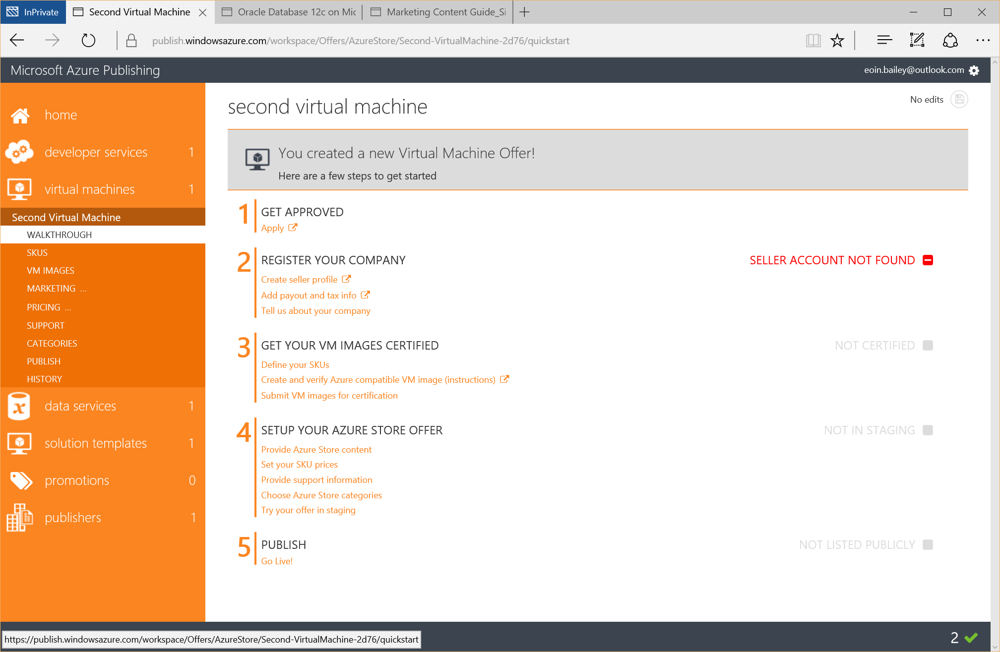
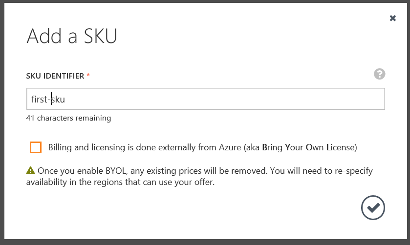
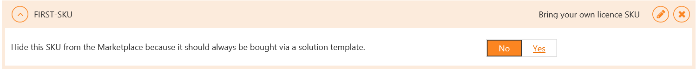
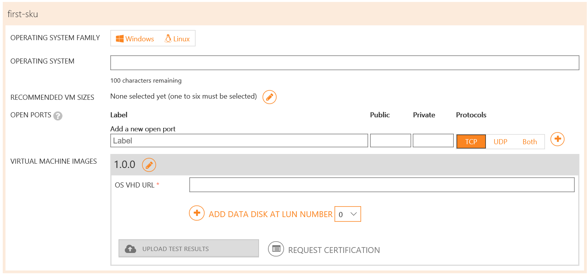
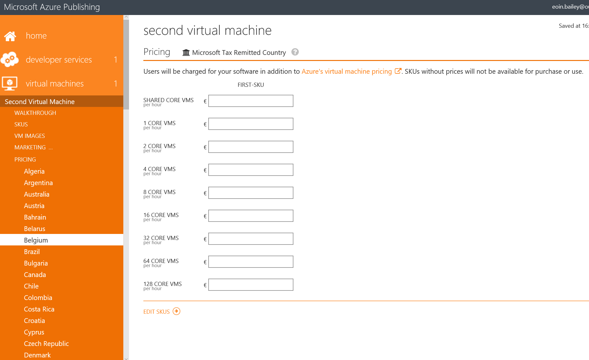

# Publisher Dashboard in Azure Marketplace

*draft*

This page covers the steps required for the Azure Marketplace Publisher Dashboard. The publisher dashboard manages the offers for [virtual machines (single VM)](Single-vm.md), [solution templates (multi-VM)](Multi-vm.md), [developer services](Developers-services.md), and [data services](Data-services.md). An offer in the publisher dashboard includes the following:

- publishers information
- description of the software/service being published
- support information
- marketplace categories
- pricing information
- sell-to countries
- samples images 

This page does not cover the development required to set up or build any software system. For information on the development of the different services please visit the page for that service.

### Pre-Requisites

For offers that will include a charge for software above the billed Azure infrastructure cost ensure the [Seller Dashboard](Seller-Dashboard.md) steps have been followed. Offers with no seller charge or a Bring Your Own Licence model do not require seller registration. 

## Registration

Visit https://publish.windowsazure.com/ with a browser. The URL will redirecte to a default [Microsoft Account](http://windows.microsoft.com/en-GB/windows-live/sign-in-what-is-microsoft-account) sign in page.

If a seller account has been configured as mentioned above use this account to login to the publishing portal.

In the instance that no seller account is being used as there are no plans to charge for an offer via the marketplace sign in with a [Microsoft Account](http://windows.microsoft.com/en-GB/windows-live/sign-in-what-is-microsoft-account).

On the first sign in to the publishing portal the Microsoft Azure Publishing Agreement needs to be read and agreed to.

# Marketplace Publisher Types

There are four options available:

- [Developer Service](Developers-services.md)
    - Provide access to an API. A published Developer Service would be targeted at other developers only.
    - *Note (Nov 2015)*: fixed monthly billing is currently the only available billing option.
- [Virtual Machine](Single-vm.md)
    - Single Virtual Machine. Generally an independent program that can be part of a larger infrastructure deployment, e.g. a virtual networking appliance, software rendering. 
- [Data Service](Data-services.md)
    - Data offered for consumption by other services. 
- [Solution Template](Multi-vm.md)
    - A complete system deployment, including Virtual Machines, networking, databases, public IP addresses and configuration to ensure resources connect with each other. 
    - *Note (Nov 2015)*: Currently requires approval to publish.

The steps for each of these options are similar in the publisher portal. 

## Virtual Machine

Select 'virtual machines' from the sidebar. Enter a title for the Virtual Machine Marketplace Offer and press 'Enter'. This title will be the title shown on the marketplace for the offer, it can be changed later (*Offer* -> *Marketing* -> *Languages* -> *Details* -> *Title*). An overview of how each field is displayed in the marketplace for an offer is [below](#offer-layout).

Apply to be a Azure Certified for a publisher account. Follow the link, http://azure.com/certified, and the directions on the page to contact Microsoft and be verified.

Register the company on the [seller dashboard](Seller-dashboard.md). The third sub-step is to fill in company information that will appear on all the marketplace offers created in this account. This step is also explained below in the [publishers](publishers) section.

Define the SKU for the offer. An offer can have multiple SKUs, each with their own Virtual Machine image and pricing configurations.

### SKU

Create a SKU new SKU selecting 'SKU' in the sub-menu for the Virtual Machine offer. Select to 'ADD A SKU' and enter a title for the SKU. If the SKU will not carry a charge on top of the Azure Infrastructure charge select the checkbox 'Billing and licensing is done externally from Azure'

Once the SKU is the option to hide the SKU is shown, for a Virtual Machine offer ensure the 'No' option is selected.

### VM Images

Follow the instructions to [build a VM](Single-vm.md). Once a VM is built and self-certified, click on 'VM Images' in the sidebar under the Virtual Machine offer. For each SKU select the Operating System Family (i.e. Windows or Linux). Enter the name of the Operating System, e.g. 'Ubuntu 14.04 LTS'.

#### Recommended VM Sizes

End users will be shown the recommended VM sizes first in the marketplace listing when selecting the offer. If the offer functions best with a certain number of cores, RAM, or premium storage, consider this when selecting the options here. 

#### Open Ports

This section specifies the public and private port mappings as well as the protocol for the VM. 

By default a VM has the following ports opened:

- Windows: 3389 -> 3389 : TCP
- Windows: 5986 -> 5986 : TCP
- Linux: 22 -> 22 : TCP

These mappings can be overridden. 

#### Virtual Machine Images

Each update of a VM requires an increment to the version number. The version starts at 1.0.0 by default. A SKU is expected to only receive minor patch updates, i.e. 1.0.0 -> 1.0.1. If a major update is being released a new SKU is the recommended practice.

The SAS URI that has been generated as part of the [single VM](Single-vm.md) steps for the OS Disk should be entered into the field for the OS VHD URL. Additional data disks as needed should also have their SAS URIs added.

The self-certification test results explained in the [single VM](Single-vm.md) steps should also be uploaded here by selecting the 'Upload Test Results' button. 

Once each of these steps are complete select 'Request Certification'. This will inform the Azure Marketplace team that the SKU and VM are ready to be certified for the Azure Marketplace. 

### Marketing

Select 'Marketing' from the sidebar. The first page asks for a Url identifier as shown on the page this value makes up part of the URL for the marketplace page of the offer.

Under Languages click on the language listed (defaults to English (US), currently no other languages are supported). The sub-sections here contain the content that will make up the various pages and sections of the Azure Marketplace where this offer will be displayed. Details on how each section is displayed is outlined [below](offer-layout).

### Pricing

The SKU will only be available under the markets that are selected. No changes can be made to the pricing once an offer is live in Production.

 - Select a Buyer’s region as the Base Market
 - If the SKU is BYOL, select the checkbox for 'Externally-licensed (BYOL) SKU availability' 
- If the SKU is hourly, enter the pricing for the software. SKUs without pricing will not be available for purchase or use.
- Prices can be set based on the number of cores in the VM an end-user deploys the SKU
	- Note: If an offer has both BYOL as well as Hourly SKUs, ensure both the requisites are covered: BYOL checkbox and price values for Hourly
 - Click on ‘AutoPrice other markets based on selected region’, the pricing wizard enables a selection of regions and foreign exchange rates (if applicable). From there prices are automatically generated for the selected markets.

### Support

Enter contact details of the person responsible for engineering support and for customer support.

### Categories

Select marketplace categories for the Virtual Machine offer.

### Publish

Once the offer and VM have been certified and all required fields have been filled push the offer to staging. This enables the offer in the marketplace for the Azure subscription associated with the publisher dashboard. 

**Tip** Clicking on Push To Staging will show an overview of any incomplete or missing steps for the offer.

Once an offer has been staged, approval can be requested to publish the offer publicly on the Azure Marketplace. 

When updating an existing offer in the Marketplace the 'View Summary and Changes' button will display the differences between the offer currently live in production and the offer as it has been edited.

### History

Displays an overview of the major steps in the process of creating, staging, and publishing an offer.

## Solution Template

Select 'solution templates' from the sidebar. Enter a title for the Solution Template and press 'Enter'. This title will be the title shown on the marketplace for the offer, it can be changed later (*Offer* -> *Marketing* -> *Languages* -> *Details* -> *Title*). An overview of how each field is displayed in the marketplace for an offer is [below](#offer-layout).

Publishing a solution template is similar in most steps to a Virtual Machine as above. There are no SKUs, VM Images, or Pricing steps. Pricing is based on the resources that are deployed by the solution template. If the template utilises custom software or configurations a Virtual Machine image can be built, and published as described above, however when creating the SKU it should be hidden from the marketplace by selecting the option as shown in the image below:

The SKU used as part of the solution template can have prices set, this is how a solution template can be charged for beyond the standard Azure consumption costs.

### Topologies

Follow the instructions on the [multi VM](Multi-vm.md) page to create a topology solution. Upload the topology files in zip format to the topology offer.

## Developer Service

Developer services currently only work with no metering and either free access or unlimited consumption. The steps for publishing a Developer Service are similar to a Virtual Machine as outlined above. The key differences are:

- A plan is equivalent to a SKU.
- Meters are not currently in use
- Resource Provider configuration and endpoints must be provided, these are equivalent to the VM Image

## Data Service

A data service is either a connection to a database service or a web service endpoint through which a consumer of the offer can access the data. The steps for publishing a Data Service are similar to a Virtual Machine as outlined above. The key differences are:

- A plan is equivalent to a SKU.
- Data Service is the access details for the database where the data resides or the web service endpoint where the data can be accessed

# Publishers

The Publishers page contains information on the company profile, e.g. name and company website. The publisher namespace is used in the URL for marketplace offers. Once an offer is published this value cannot be changed.

## Adminstrators

It is possible to add multiple co-administrators to a publisher dashboard, this may be useful if a developer controls and knows the details of the Virtual Machine image and enters that information while the marketing co-administrators enters the information on the company profile.

# Layout of a Published Marketplace Offer

- A marketplace URL is constructed with the following values from the offer:
	- Azure.com – http://azure.microsoft.com/en-us/marketplace/partners/[PublisherNamespace]/[OfferIdentifier]-[SKUidentifier]
    - Ibiza Portal - https://portal.azure.com/#gallery/[PublisherNamespace].[OfferIdentifier][SKUIDdentifier]

# Promotions

Promotions cannot be accessed until an offer is published.

Promotion codes are not available for plans that charge customers based on metered usage. This includes Virtual Machines and Developer Services with meters. 