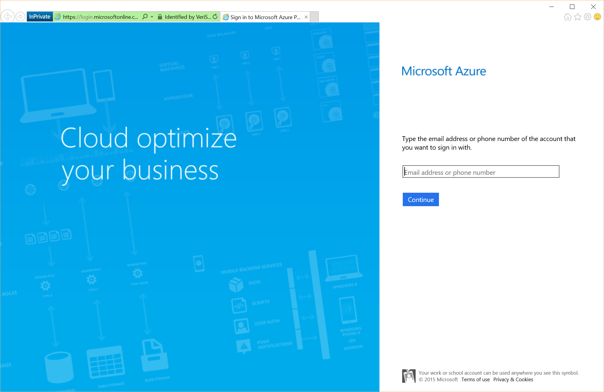
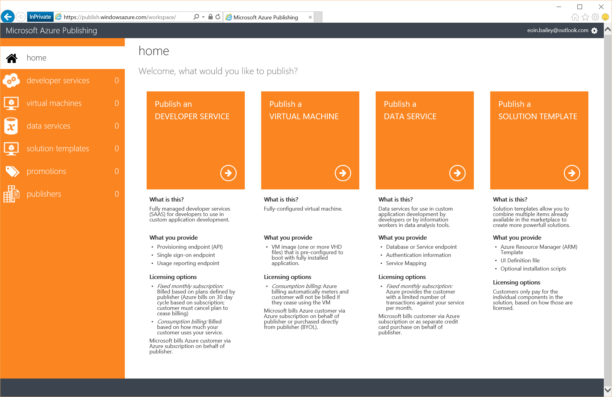

# Publisher Dashboard in Azure Marketplace

*draft*

This page covers the steps required for the Azure Marketplace Publisher Dashboard. The publisher dashboard manages the offers for [virtual machines (single VM)](Single-vm.md), [solution templates (sometimes called multi-VM)](Multi-vm.md), [developer services](Developers-services.md), and [data services](Data-services.md). An offer in the publisher dashboard includes the following:

- description of your software
- support information
- marketplace categories
- pricing information
- sell-to countries
- samples images 

For information on the development of the different services please visit the page for that service.

### Pre-Requisites

If you plan on charging for your offers in the Azure Marketplace ensure you have filled in the [Seller Dashboard](Seller-Dashboard.md). 
Offers with no seller charge or a Bring Your Own Licence model do not require seller registration. 

## Registration

Visit https://publish.windowsazure.com/ with your favourite browser. You will be redirected to a default [Microsoft Account](http://windows.microsoft.com/en-GB/windows-live/sign-in-what-is-microsoft-account) sign in page.

If you have a seller account as mentioned above login to the publishing portal with the same account used to register for the seller dashboard.

If you do not have a seller account as you do not plan to charge for your offers via the marketplace sign in with a [Microsoft Account](http://windows.microsoft.com/en-GB/windows-live/sign-in-what-is-microsoft-account).

On your first sign in to the publishing portal you will be shown the Microsoft Azure Publishing Agreement. Please read this and confirm you agree with the terms outlined.

After agreeing you will be brought to the homepage of the publisher portal.

# Marketplace Options

There are four options available:

- [Developer Service](Developers-services.md)
    - Provide access to an API. Targeted at developers only.
    - *Note (Nov 2015)*: fixed monthly billing is currently the only available billing option.
- [Virtual Machine](Single-vm.md)
    - Single Virtual Machine. Generally an independent program that can be part of a larger infrastructure deployment, e.g. a virtual networking appliance, software rendering. 
- [Data Service](Data-services.md)
    - Data offered for consumption by other services. 
- [Solution Template](Multi-vm.md)
    - A complete system deployment, including Virtual Machines, networking, databases, public IP addresses and configuration to ensure components can connect with each other. 
    - *Note (Nov 2015)*: Currently requires approval to publish.

## Developer Service

## Virtual Machine

## Data Service

## Solution Template
