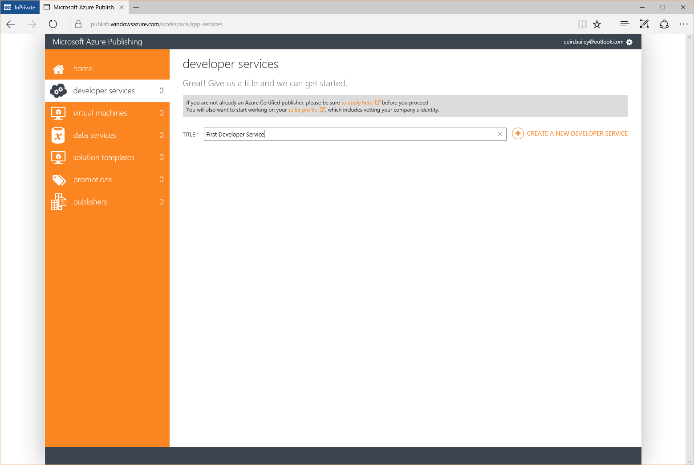
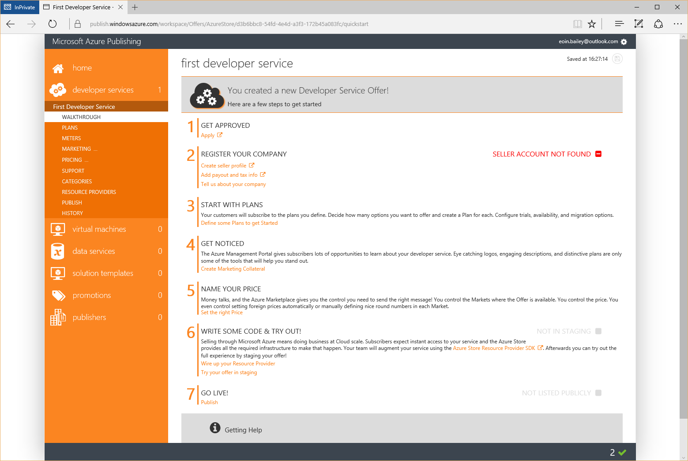

# Publisher Dashboard in Azure Marketplace

*draft*

This page covers the steps required for the Azure Marketplace Publisher Dashboard. The publisher dashboard manages the offers for [virtual machines (single VM)](Single-vm.md), [solution templates (multi-VM)](Multi-vm.md), [developer services](Developers-services.md), and [data services](Data-services.md). An offer in the publisher dashboard includes the following:

- publishers information
- description of your software
- support information
- marketplace categories
- pricing information
- sell-to countries
- samples images 

This page does not cover the development required to set up or build any software system. For information on the development of the different services please visit the page for that service.

### Pre-Requisites

For offers that will include a charge for software above the billed Azure infrastructure cost ensure the [Seller Dashboard](Seller-Dashboard.md) steps have been followed. Offers with no seller charge or a Bring Your Own Licence model do not require seller registration. 

## Registration

Visit https://publish.windowsazure.com/ with a browser. The URL will redirecte to a default [Microsoft Account](http://windows.microsoft.com/en-GB/windows-live/sign-in-what-is-microsoft-account) sign in page.

If a seller account has been configured as mentioned above use this account to login to the publishing portal.

In the instance that no seller account is being used as there are no plans to charge for an offer via the marketplace sign in with a [Microsoft Account](http://windows.microsoft.com/en-GB/windows-live/sign-in-what-is-microsoft-account).

On the first sign in to the publishing portal the Microsoft Azure Publishing Agreement needs to be read and agreed to.

# Marketplace Publisher Types

There are four options available:

- [Developer Service](Developers-services.md)
    - Provide access to an API. Targeted at developers only.
    - *Note (Nov 2015)*: fixed monthly billing is currently the only available billing option.
- [Virtual Machine](Single-vm.md)
    - Single Virtual Machine. Generally an independent program that can be part of a larger infrastructure deployment, e.g. a virtual networking appliance, software rendering. 
- [Data Service](Data-services.md)
    - Data offered for consumption by other services. 
- [Solution Template](Multi-vm.md)
    - A complete system deployment, including Virtual Machines, networking, databases, public IP addresses and configuration to ensure components can connect with each other. 
    - *Note (Nov 2015)*: Currently requires approval to publish.

The steps for each of these options are similar in the publisher portal. 

## Developer Service

Select 'developer services' from the sidebar or list of options on the page. Enter a title for the service and press 'Enter'. This title will be the title shown on the marketplace for your offer, it can be changed later (*Offer* -> *Marketing* -> *Languages* -> *Details* -> *Title*). An overview of how each field is displayed in the marketplace for an offer is [below](#offer-layout).

Once a service is created the portal will provide an overview of every step of the process.

## Virtual Machine

## Data Service

## Solution Template

# Publishers Information

Publisher Name space

## Layout of a Published Marketplace Offer

What entries make up the URL?