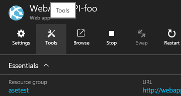
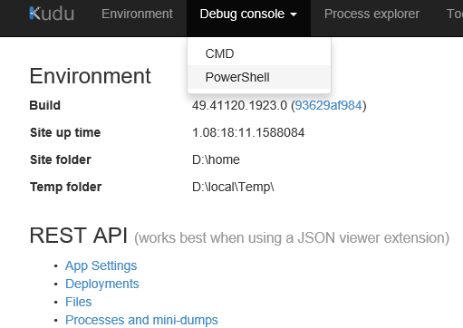
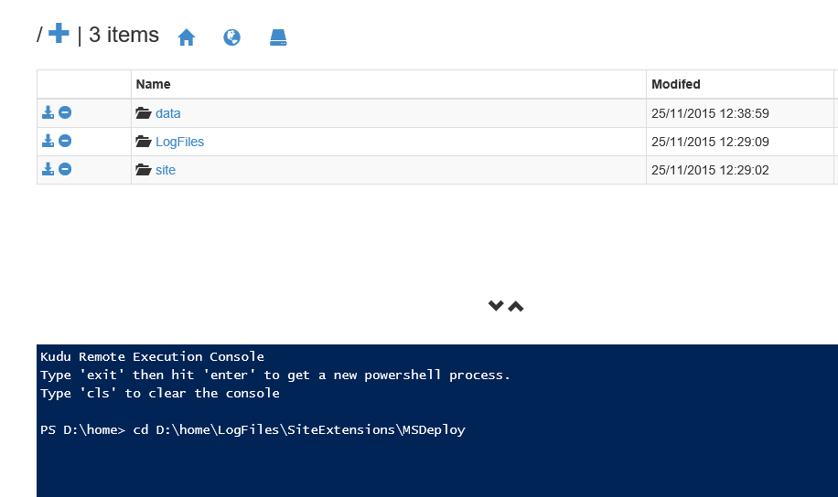
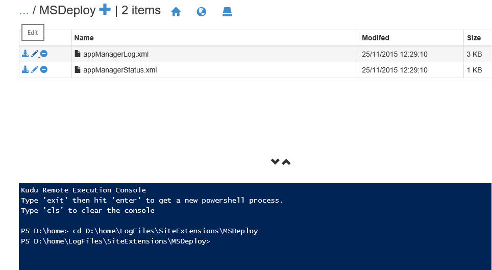

# Debugging MSDeploy errors with Azure Web Apps
When you use the MSDeploy site extension to deploy web app content from an ARM template, the errors you get back are generally pretty vague. ** TODO - Add link to scenario when written up **

```json
{
    "provisioningState": "Failed",
    "timestamp": "2015-11-25T12:29:19.4734883Z",
    "resourceType": "Microsoft.Web/sites/Extensions",
    "resourceName": "WebApp-API-foo/MSDeploy",
    "error": {
      "code": "ResourceDeploymentFailure",
      "message": "The resource operation completed with terminal provisioning state 'Failed'."
    }
}
```

To find out what the underlying error was, you need to use the site's [Kudu Console](https://github.com/projectkudu/kudu/wiki/Kudu-console).

## Open the Kudu Console
To open the Kudu Console, you can go to `{yoursite}.scm.azurewebsites.net`, and log in with your credentials for the Azure Portal.

Or if you prefer, you can access this from the portal (http://portal.azure.com). Navigate to the Web App that you deployed, and click on Tools at the top of the blade



In the Tools blade that opens, scroll down to the Develop section and click Kudu


## Navigate to the MSDeploy logs

In the Kudu console, open the Debug console



From there, either click on the hyperlinks to navigate to the D:\home\LogFiles\SiteExtensions\MSDeploy directory or type `cd D:\home\LogFiles\SiteExtensions\MSDeploy`



In the MSDeploy directory there will be two log files: appManagerLog.xml and appManagerStatus.xml. The appManagerLog.xml is the file that contains the details, so either click on Download button next to it to save it to your computer or simply click the Edit button to view the log in the browser. 



An example log file is shown below. In this case, the package Uri was invalid.

```xml
<?xml version="1.0" encoding="utf-8"?>
<entries>
    <entry time="2015-11-25T12:29:11.3340574+00:00" type="Message">
        <message>Downloading metadata for package path '' from blob 'http://example.com'</message>
    </entry>
    <entry time="2015-11-25T12:29:11.3506776+00:00" type="Error">
        <message>AppGallery Deploy Failed: 'System.ArgumentException: The argument must not be empty string.
Parameter name: blobAbsoluteUriString
   at Microsoft.WindowsAzure.StorageClient.CommonUtils.AssertNotNullOrEmpty(String paramName, String value)
   at Microsoft.WindowsAzure.StorageClient.CloudBlobClient.GetBlobReference(String blobAddress, Nullable`1 snapshotTime)
   at Microsoft.Web.Deployment.WebApi.AppGalleryPackage.IsPremiumApp()
   at Microsoft.Web.Deployment.WebApi.DeploymentController.CheckCanDeployIfAppIsPremium(AppGalleryPackageInfo packageInfo, Boolean&amp;amp; isPremium)'</message>
    </entry>
    <entry time="2015-11-25T12:29:11.6153171Z" type="Message">
        <message>Downloading package path '' from blob 'http://example.com'</message>
    </entry>
    <entry time="2015-11-25T12:29:11.6153171Z" type="Error">
        <message>Failed to download package.</message>
    </entry>
    <entry time="2015-11-25T12:29:11.6309427Z" type="Error">
        <message>AppGallery Deploy Failed: 'System.ArgumentException: The argument must not be empty string.
Parameter name: blobAbsoluteUriString
   at Microsoft.WindowsAzure.StorageClient.CommonUtils.AssertNotNullOrEmpty(String paramName, String value)
   at Microsoft.WindowsAzure.StorageClient.CloudBlobClient.GetBlobReference(String blobAddress, Nullable`1 snapshotTime)
   at Microsoft.Web.Deployment.WebApi.AppGalleryPackage.&lt;Download&gt;d__4.MoveNext()
--- End of stack trace from previous location where exception was thrown ---
   at System.Runtime.CompilerServices.TaskAwaiter.ThrowForNonSuccess(Task task)
   at System.Runtime.CompilerServices.TaskAwaiter.HandleNonSuccessAndDebuggerNotification(Task task)
   at Microsoft.Web.Deployment.WebApi.AppGalleryPackage.&lt;Download&gt;d__0.MoveNext()
--- End of stack trace from previous location where exception was thrown ---
   at System.Runtime.CompilerServices.TaskAwaiter.ThrowForNonSuccess(Task task)
   at System.Runtime.CompilerServices.TaskAwaiter.HandleNonSuccessAndDebuggerNotification(Task task)
   at Microsoft.Web.Deployment.WebApi.DeploymentController.&lt;DownloadAndDeployPackage&gt;d__b.MoveNext()'</message>
    </entry>
</entries>
```
