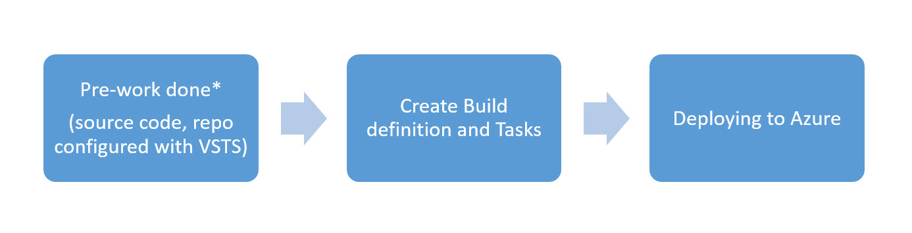
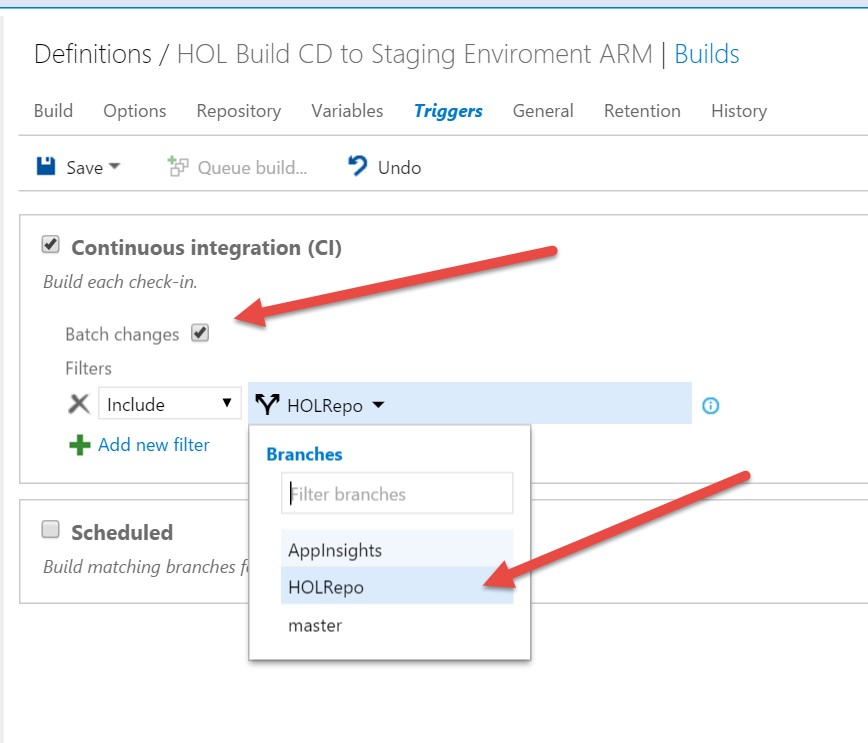
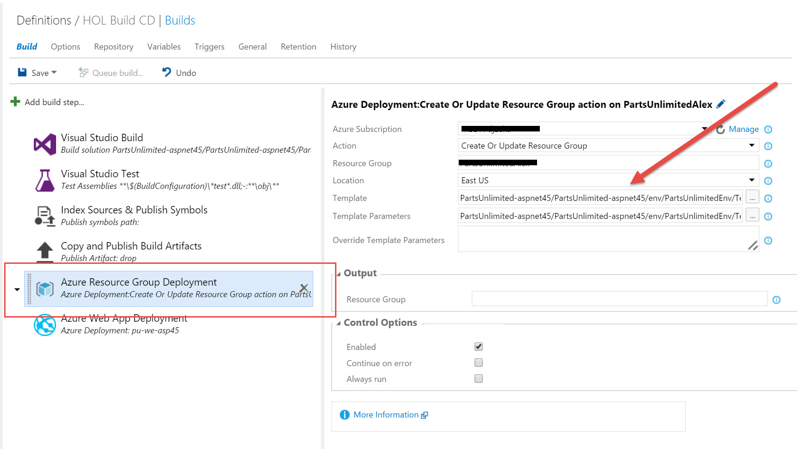
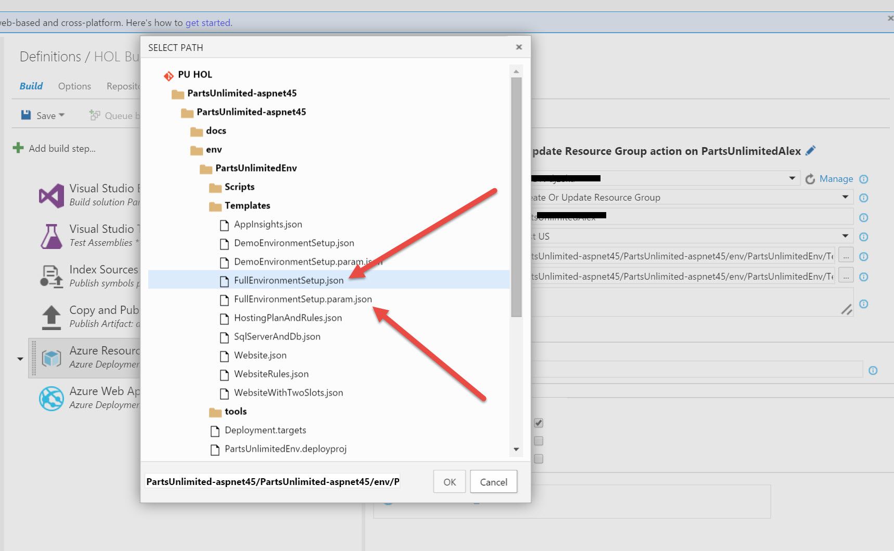
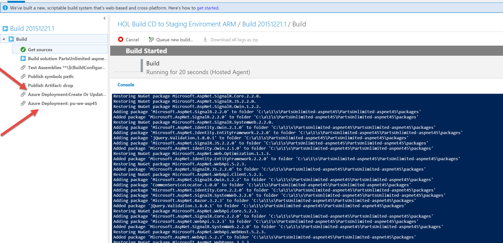

# Deploying a Web application and SQL Database to Azure using an ARM template task in the Build process
#

##Overview
In this scenario we focus on VSTS as a source code repository, Continuous Integration (CI) and Continuous Deployment (CD) components to manage the code. Define a build process with an ARM template task as Infrastructure as Code (IaC) component, conduct tests and deploy your application to Azure

##1. Pre-Work
Setup Visual Studio Team Services to enable continuous code integration. This means that when code is committed and pushed to the selected branch checks are run  to get fast feedback that the changes will integrate into our code correctly. To do so you will set up a Continuous Integration build (CI)
 

Pre-requisites:

- An active Azure subscription
- An active Visual Studio Team Services account
- Visual Studio 2015
- Project admin rights to the Visual Studio Team Services account
- Your code
- A  [**service end point**](https://msdn.microsoft.com/Library/vs/alm/Release/getting-started/deploy-to-azure#createazurecon) configured in VSTS with rights to connect to your Azure subscription

> **Note:** More details on how to set this up, you can find at following link:
  [**WebSite Continuous Integration with Visual Studio Online**](https://github.com/Microsoft/PartsUnlimited/blob/hands-on-labs/docs/HOL_PartsUnlimited_WebSite_Continuous_Integration/HOL_PartsUnlimited_WebSite_Continuous_Integration_with_Visual_Studio_Online_Build.md)

## 2. Create Continuous Integration Build and Tasks
A continuous integration build will give us the ability to check whether the code
we checked in compiles and will successfully pass any automated tests that we
have created against it.

> **Note:** You can use [**this**](https://github.com/Microsoft/PartsUnlimited/blob/hands-on-labs/docs/HOL_PartsUnlimited_WebSite_Continuous_Integration/HOL_PartsUnlimited_WebSite_Continuous_Integration_with_Visual_Studio_Online_Build.md#2-create-continuous-integration-build) reference to create your own Build process
> 

## 3. Deploying to Azure

In this step you will create the Build task that will have an "Azure Resource Group Deployment" step that will use an ARM template from your Source code repo to initially create the environment and/or enforce configuration.

> **Note:** For more information on creating ARM templates go to [**Azure Resource Manager Templates**](https://github.com/dx-ted-emea/ARM-Documentation/tree/master/ARM#azure-resource-manager-templates)

#
**1. First add the Azure Resource Group Deployment step**

#
**2. Choose the correct deployment template and parameters file**

 >**Note:** Here you can find an example [**template**](https://github.com/Azure/azure-quickstart-templates/blob/master/201-web-app-sql-database/azuredeploy.json) and [**parameters file**](https://github.com/Azure/azure-quickstart-templates/blob/master/201-web-app-sql-database/azuredeploy.parameters.json) for a deployment of an Azure WebApp and SQL Database 

#
**3. Start a Build and deployment**

##Next Steps
This is a simple way to leverage ARM templates for IaC within a build process. If you have more complex release management requirements go to this [**link**](Deploying-Web-app-using-RM.md) to see how to configure Release Management within VSTS.

