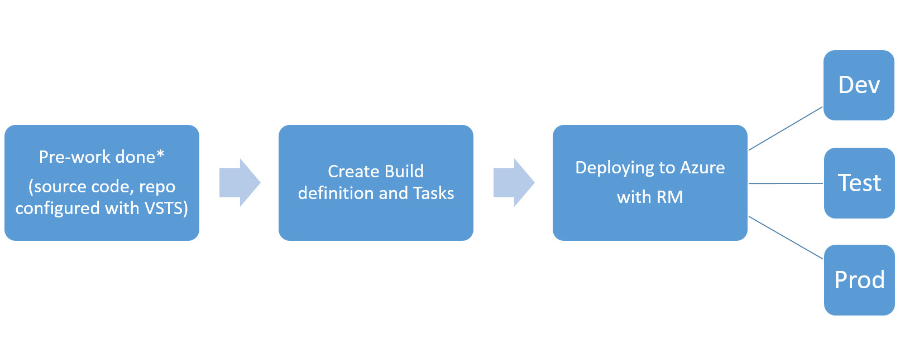

# Deploying a Web application and SQL Database to Azure using ARM templates with Release Management in VSTS
#

##Overview
In this scenario we focus on VSTS as a source code repository, Continuous Integration(CI), Continuous Deployment(CD) and Release Management(RM) components to manage the code. Release management is used for deployment of the application to multiple environments in Azure using ARM templates to build these environments and with a approval and acceptance chain.

##1. Pre-Work
Setup Visual Studio Team Services to enable continuous code integration. This means that when code is committed and pushed to the selected branch checks are run  to get fast feedback that the changes will integrate into our code correctly. To do so you will set up a Continuous Integration build (CI)
 
Pre-requisites:

- An active Azure subscription
- An active Visual Studio Team Services account
- Visual Studio 2015
- Project admin rights to the Visual Studio Team Services account
- Your code

## 2. Create Continuous Integration Build and Tasks
A continuous integration build will give us the ability to check whether the code
we checked in compiles and will successfully pass any automated tests that we
have created against it.

Follow [**this**](https://github.com/Microsoft/PartsUnlimited/blob/hands-on-labs/docs/HOL_PartsUnlimited_WebSite_Continuous_Integration/HOL_PartsUnlimited_WebSite_Continuous_Integration_with_Visual_Studio_Online_Build.md)  steps to configure and setup CI/CD

## 3. Deploy to Azure with RM using ARM templates
The Release Management defines how your application moves through various Environments, including Tasks to update infrastructure, deploy your application, run scripts and run tests. You can also configure incoming or outgoing approvals for each Environment. Follow [**this**](https://github.com/Microsoft/PartsUnlimited/blob/hands-on-labs/docs/HOL_PartsUnlimited_WebSite_Continuous_Deployment/HOL_Continuous_Deployment_Release_Management.md#2-modify-the-ci-build-to-include-the-arm-templates)  steps to configure and setup RM

##Conclusion and Next Steps
After you have finished all steps, in this scenario, you have exercised IaC, CI/CD, RM leveraging Azure ARM templates to define, configure and deploy your solution/app.
  
To learn more about VSTS and to follow the news, find technical documentation and etc. follow this [**link**](https://azure.microsoft.com/en-us/services/visual-studio-team-services/)

